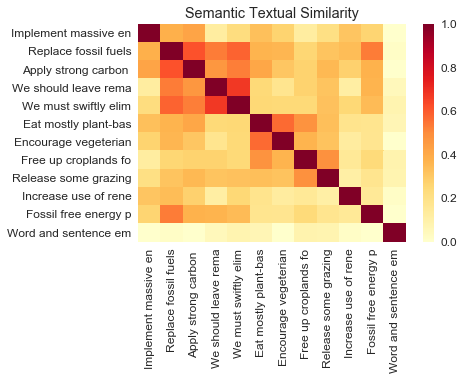

# data_analysis
Work done for the Yale Open Climate Collabathon

## Semantic similarity 

We explore what we can get from the semantics of the texts submitted by actors

For demonstrative purpose we look at semantic similarity between several commitments put forward in the action plans of the Covenant of Mayors (CoM) members, and some of the actions identified as most urgent and effective in the World Scientists’ Warning of a Climate Emergency (citation). To achieve this we make use of Google’s pre-trained Universal Sentence Encoder model (Cer et al., 2018), which encodes text in high dimensional vectors. 

- semantic plot + list of example texts

Using the model on our example sentences, we see that it correctly groups the energy-related statements and diet-related statements. We also notice that there is no clear separation into different groups, which makes sense given that these issues are interrelated and likely show up in similar contexts in the datasets that the model has been trained on. The example extracted from the CoM dataset "fossil free energy production" is found to be similar to the energy-related statements, the highest overlap being with "Replace fossil fuels with low-carbon renewables". 

Finally, the control sentence is correctly found to be unrelated to the rest. 

Already the simple semantic similarity comparison with USE can give us some measure of how well the actors are aligned with the actions we are interested in, but it is also possible to tweak the pre-trained model further to increase precision for a specific task. 

